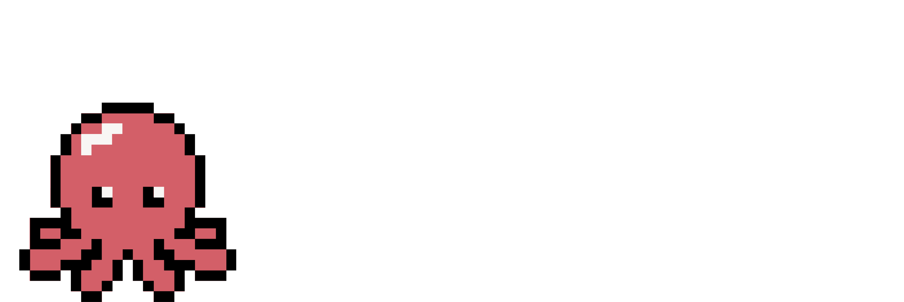

<p align="center">
  <a href="https://docs.modaic.dev">
    
  </a>
  <a href="https://pypi.org/project/modaic/">
    
  </a>
  <a href="https://deepwiki.com/modaic-ai/modaic">
    
  </a>
</p>

<p align="center">
  
</p>

# Modaic = Modular + Mosaic

Modaic is a framework for quickly deploying optimized language models for repeatable, non-verifiable tasks, such as llm-as-judge, triage, classification, and routing. We build on the “Declarative AI Programming” standard introduced by [DSPy](https://dspy.ai) and leverage frontier research in interpretability for uncertainty estimation.

## Key Features

- **Hub Support**: Package DSPy programs to re-use across projects and teams in one line of code.
- **Reliable Confidence Estimation**: Use dedicated probes to extract calibrated confidence scores from your models when they generate decisions or labels (for discrete decision tasks like classification and LM judging).
- **Automatic Alignment**: Set ground truth + feedback to automatically align your models with your decision rules and industry expertise with GEPA.

## Installation

### Using uv (recommended)

```bash
uv add modaic
```

Optional (for platform operations):

```bash
export MODAIC_TOKEN="<your-token>"
```

### Using pip
Please note that you will not be able to push DSPY programs to the Modaic Hub with pip.
```bash
pip install modaic
```

## Support

For issues and questions:
- GitHub Issues: `https://github.com/modaic-ai/modaic/issues`
- Docs: `https://docs.modaic.dev`

## Development

install development dependencies:
```bash
uv sync --all-extras
```
