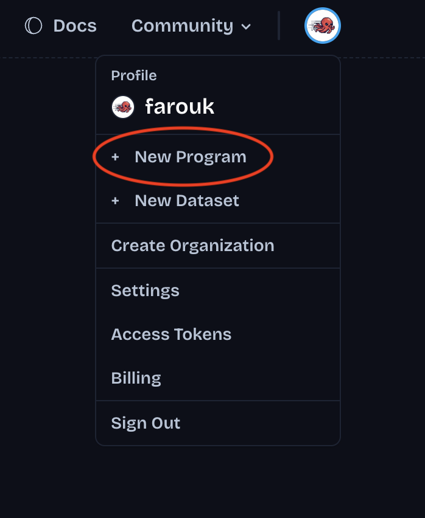
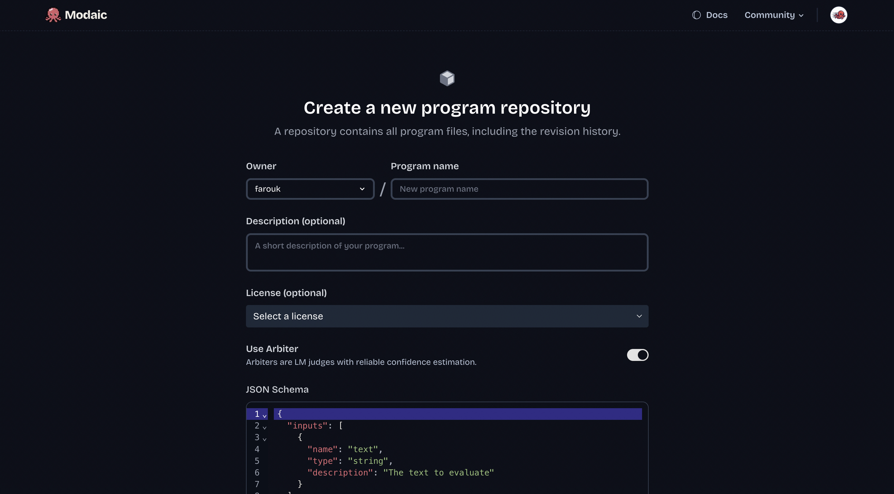

### There are two ways to create an arbiter:

1. **Using the Modaic Web UI**: Go to https://modaic.dev/new and create your arbiter there with a JSON schema.




2. **Using the Modaic SDK**: Install the Modaic SDK and create your arbiter locally.

First, install the Modaic SDK with [uv](https://docs.astral.sh/uv/):

```bash
uv add modaic
```

Then, create your arbiter:

<Info>
  Make sure you have a Modaic token set in your environment variables. You can
  get one [here](https://modaic.dev/settings/tokens).
</Info>

```python
import dspy
import modaic


class CodeCompletionSignature(dspy.Signature):
    """Given a prompt and a code completion in luau, Roblox's scripting language,
    evaluate the quality and relevance of the code completion in relation to the prompt.
    """
    prompt: str = dspy.InputField(desc="The prompt")
    completion: str = dspy.InputField(desc="The code completion to evaluate")
    quality: int = dspy.OutputField(desc="The quality of the completion (1-4)")


if __name__ == "__main__":
    code_completion_arbiter = modaic.Predict(
        CodeCompletionSignature,
        lm=modaic.SafeLM(model="together_ai/Qwen/Qwen3-VL-8B-Instruct"),
    ).as_arbiter()
    code_completion_arbiter.push_to_hub(
        "roblox/code-completions", private=True
    )
```

<Warning>
  There needs to be exactly one ``dspy.OutputField`` in your signature for an
  arbiter, which defines the shape of the output — as a builtin type or a
  pydantic model. In the example above, the output is an integer between 1 and
  4. There is no limit or minimum on the number of ``dspy.InputField`` you can
  have.
</Warning>
