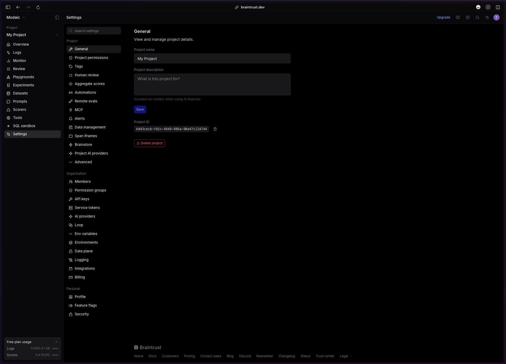

You can use an Arbiter from Modaic Hub as a scorer in Braintrust. This allows you to score Braintrust traces with a continuously improving evaluator.

## Create an Arbiter
Create your arbiter and push it to Modaic Hub.

## Set the MODAIC_TOKEN
Click on the "Settings" tab at the bottom of the sidebar menu


Click on the "Env variables" tab on the Settings menu and add your `MODAIC_TOKEN` as an environment variable.


## Create a Code Scorer
### Installation
Install the braintrust sdk and cli. 

**With uv**
```bash
uv add braintrust[cli]
```
**With pip**
```bash
pip install braintrust[cli]
```
### Code
Create a code scorer that uses your arbiter.
```python scorer.py
import braintrust
from pydantic import BaseModel
from modaic_client import Arbiter

project = braintrust.projects.create(name="My Project") # name can be new project or existing project


class CorrectnessParams(BaseModel):
    input: dict
    output: dict


def correctness_scorer(input: dict, output: dict):
    arbiter = Arbiter("modaic/correctness")
    run = {
        "input": input,
        "output": output,
    }
    _, result = arbiter.predict(run)
    return result.output # output of the arbiter will always be in the `output` field. 
    # return {"score": result.output, "reasoning": result.reasoning} can return the reasoning as well


project.scorers.create(
    name="Correctness Scorer",
    slug="correctness-scorer",
    description="Check if the output is correct",
    parameters=CorrectnessParams,
    handler=correctness_scorer,
    metadata={"__pass_threshold": 0.5},
)
```
<Warning>
Your arbiter must accept the schema you pass into `predict`. In this case the `modaic/correctness` arbiter accepts the fields `input: dict` and `output: dict` and returns a boolean label.
</Warning>
### Requirements.txt
Create a requirements.txt to tell braintrust to install the modaic-client package.
```txt requirements.txt
modaic-client
```
### Upload
Upload the code scorer to braintrust.

**With uv**
```bash
uv run braintrust push scorer.py --requirements requirements.txt
```
**With pip/global install**
```bash
braintrust push scorer.py --requirements requirements.txt
```
