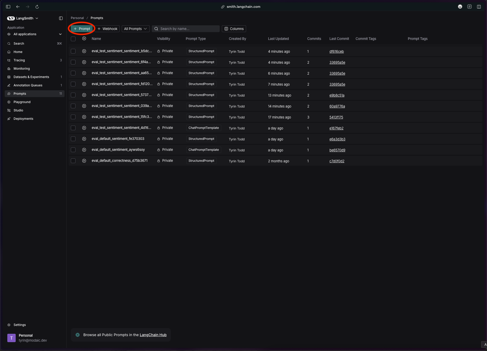
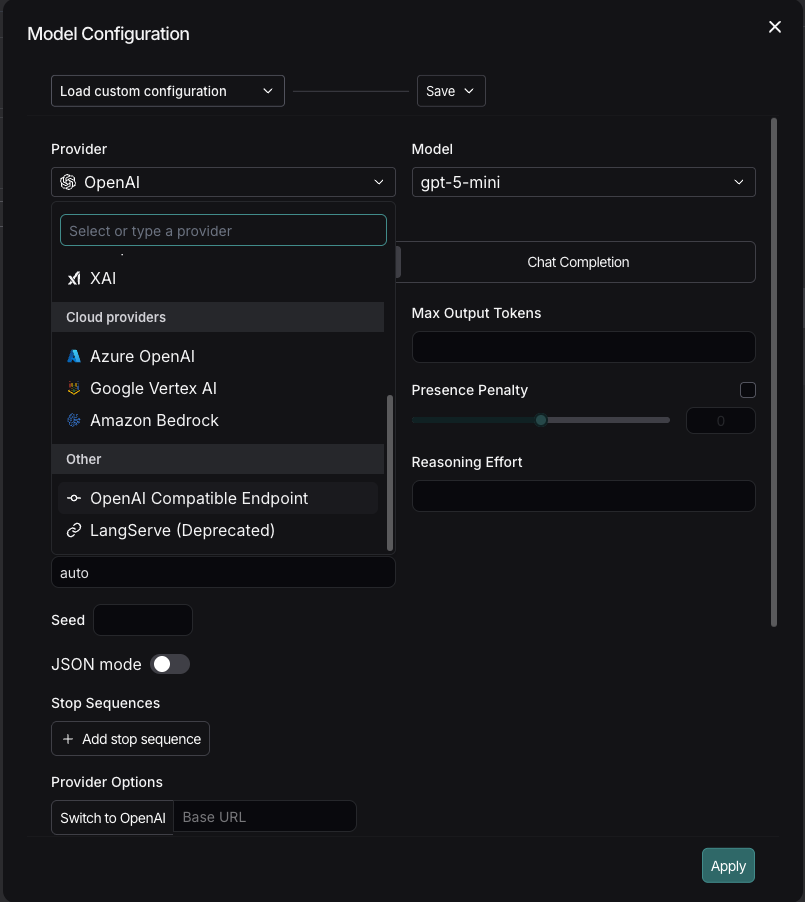
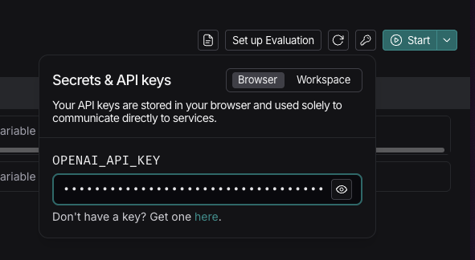
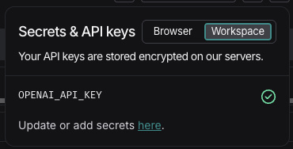
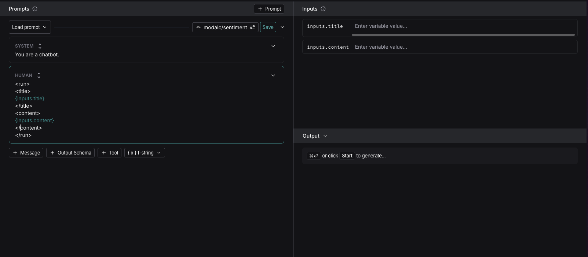

You can use an Arbiter from Modaic Hub as an LLM judge in LangSmith. This allows you to score LangSmith traces with a continuously improving evaluator.

1. Create your arbiter on [Modaic Hub](https://hub.modaic.dev).

2. Navigate to the **Prompts** tab in LangSmith and click the **+ Prompt** button.


3. Click the model name to configure provider settings.


4. Set the provider to **OpenAI Compatible Endpoint**.


5. Set the model to the name of your arbiter on Modaic Hub. It should be in the format `<entity>/<arbiter-name>`.


6. Select **Chat Completions** as the **Provider API** and set the **Base URL** to:
```
https://api.modaic.dev/api/v1/arbiters
```


7. Save the provider configuration.

8. Ensure `OPENAI_API_KEY` is set to your Modaic Hub token. LangSmith can store secrets in two locations: browser secrets and workspace secrets. Both are shown below.

<Tabs>
<Tab title="Browser Secrets">

</Tab>
<Tab title="Workspace Secrets">


</Tab>
</Tabs>

9. Lastly, template the prompt so Modaic can parse it correctly.

Use XML tags to wrap the input fields for your arbiter. For example, if your arbiter takes the fields `title` and `content`, you would template your prompt like this:

```xml
<run>
<title>
{inputs.title}
</title>
<content>
{inputs.content}
</content>
</run>
```

In LangSmith, `{inputs.title}` retrieves the `title` field from the inputs of a dataset row or run. This is forwarded to the prompt template and wrapped with XML tags that inform Modaic which field corresponds to which input.



<Warning>
Modaic's backend does not execute the LLM as a standard completions endpoint. 

It parses the XML and then passes the resulting dictionary through an Arbiter that processes the specified fields.

It is critical that the formatting is correct. For assistance setting up your arbiter with LangSmith, reach out to us on [Discord](https://discord.com/invite/5NZ3GZNq5k) or via [email](mailto:team@modaic.dev).
</Warning>
